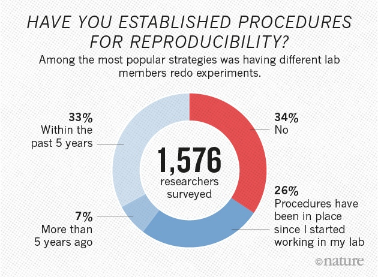
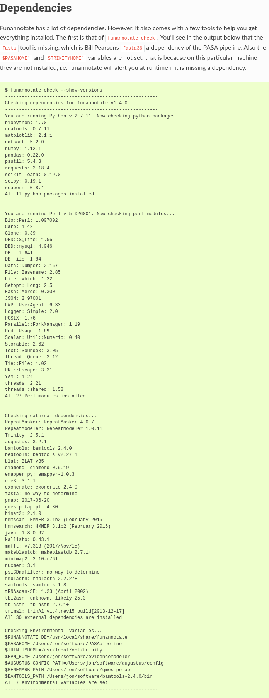
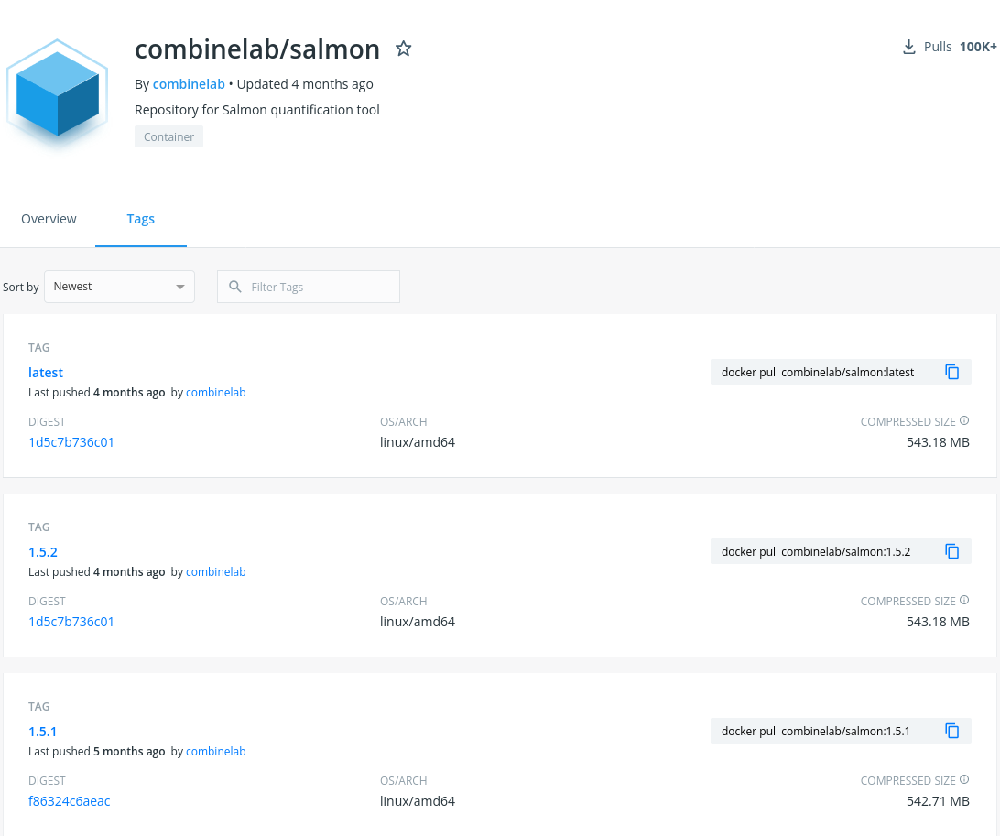
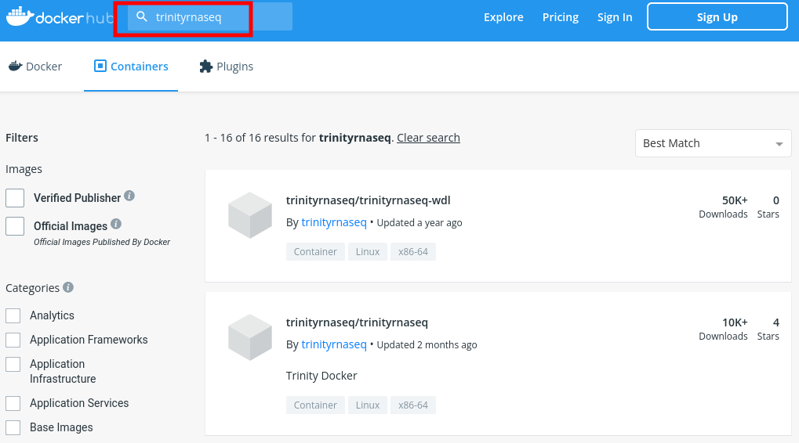
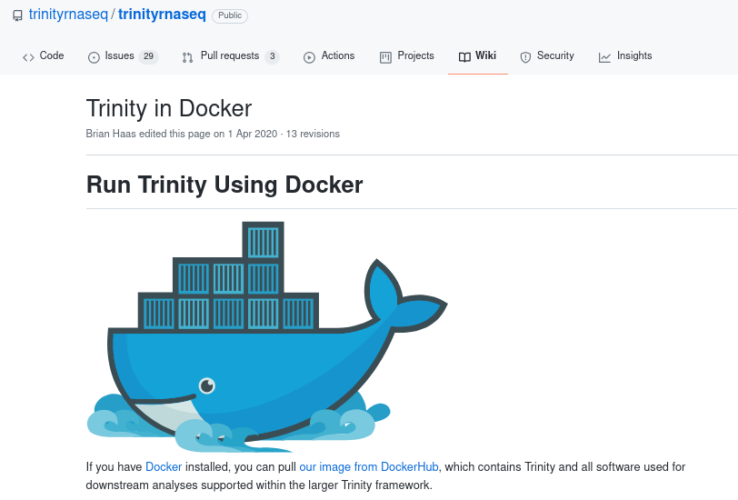
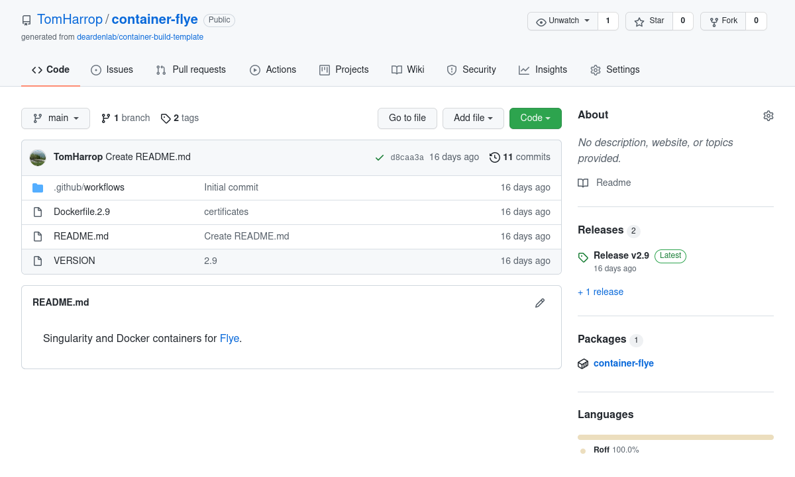
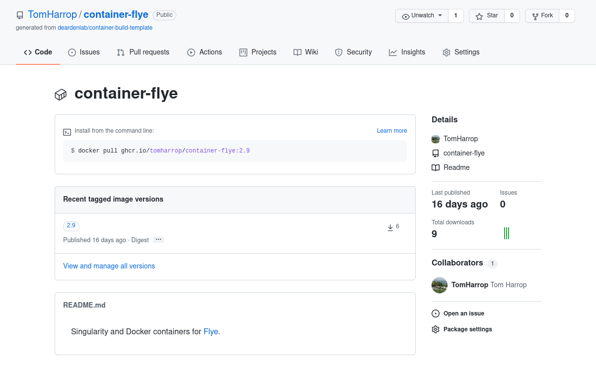
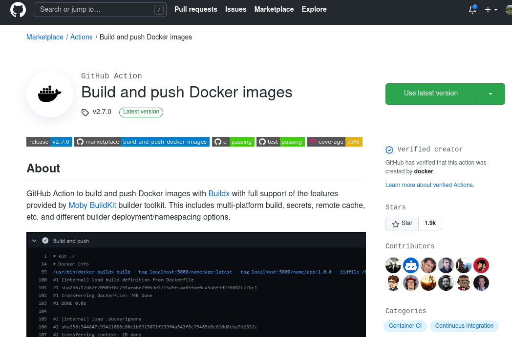

## Reproducibility

:::::::::::::: {.columns align="center"}
::: {.column width="0.5"}

{height=50mm}

:::
::: {.column width="0.5"}

{height=50mm}

:::
::::::::::::::


\source{
    Jenny Bryan \href{https://youtu.be/7oyiPBjLAWY}{https://youtu.be/7oyiPBjLAWY} \&
    Nature News, \href{http://www.nature.com/news/1-500-scientists-lift-the-lid-on-reproducibility-1.19970}{10.1038/533452a}}

::: notes
\tiny
- from 2016
- if we want our analysis to be reproducible it's up to us to do it
- getting much easier now
:::


## Analysis practices

:::::::::::::: {.columns align="top"}
::: {.column width="0.5"}

**Guidelines**:

1. Don't modify raw data
2. Record the steps  
   (with version control)
3. Capture the computing environment

:::
::: {.column width="0.5"}

- Data management:
    - see Gayle Philip's slides
- Project management, source control:
    - Jessica Chung's slides
- Workflow management:
    - Bobbie Shaban's slides
- Reproducible computing:
    - use containers

:::
::::::::::::::

::: notes
\tiny
- basic guidelines for reproducible bioinformatics
- Gayle covered management of the raw data
- naming, etc
- Jess covered reproducible practices
- saving your steps in a notebook and keeping them under version control
- Bobbie covered workflow managers (also under version control)

\vspace{2ex}

- no one will try to reproduce your analysis
- beneficiary is future me
:::

## Why use containers?

:::::::::::::: {.columns align="center"}
::: {.column width="0.5"}

{height=30mm}

:::
::: {.column width="0.5"}

{height=30mm}

:::
::::::::::::::

 

\vspace{5mm}

 

:::::::::::::: {.columns align="top"}
::: {.column width="0.2"}


:::
::: {.column width="0.8"}


\setbeamersize{description width of=(Motivation:)}

Motivation:

:  Use software without installing it

. . . 

\vspace{1ex}

Benefits:

:  Portability, reproducibility

. . . 

\vspace{1ex}


Drawbacks:

:  Effort

:::
::::::::::::::

::: notes
\tiny
- there are other container systems
- and other methods for a reproducible workflow
- portability: take your container anywhere and run it
- reproducibility: same container, same results
:::

## Use software without installing it


:::::::::::::: {.columns align="top"}
::: {.column width="0.5"}

\footnotesize

**On my computer**:

```{r samtools_1, engine="bash", echo=TRUE, eval=FALSE}
# not provided for my OS
guppy_basecaller --version
```


`    guppy_basecaller: command not found`

:::
::: {.column width="0.5"}

\footnotesize

**Using a container**:

```{r samtools_2, engine="bash", echo=TRUE, eval=TRUE, comment = "    "}
singularity exec guppy_5.0.16.sif \
    guppy_basecaller --version
```

:::
::::::::::::::

::: notes
\tiny
- previous versions of guppy could only be installed on really outdated operating systems
- wrestle with dependencies to get it installed on your desktop computer?
:::

## Get the version you need

:::::::::::::: {.columns align="top"}
::: {.column width="0.5"}

\footnotesize

**On my computer**:

```{r newtools1, engine="bash", echo=TRUE, eval=FALSE, comment = "    "}
# installed by my OS package manager
samtools --version
```


```{r newtools4, engine="bash", echo=FALSE, eval=TRUE, comment = "     "}
samtools --version | head -n 3
```


:::
::: {.column width="0.5"}

\footnotesize

**Using a container**:

```{r newtools2, engine="bash", echo=TRUE, eval=FALSE, comment = "    "}
singularity exec samtools_1.12.sif \
    samtools --version
```


```{r newtools3, engine="bash", echo=FALSE, eval=TRUE, comment = "     "}
singularity exec samtools_1.12.sif \
    samtools --version | head -n 3
```


:::
::::::::::::::

::: notes
\tiny
- samtools UI has changed
- same command, different version, different results
:::


## Avoid tricky software installations

:::::::::::::: {.columns align="center"}
::: {.column width="0.3"}

{height=70mm}

:::
::: {.column width="0.7"}


- lots of dependencies

- not all dependencies are listed

. . .

- need specific versions

- package managers don't always help

. . .

\footnotesize

```{.bash}

singularity run docker://nextgenusfs/funannotate

```

:::
::::::::::::::

\source{
     \href{https://funannotate.readthedocs.io/en/latest/dependencies.html\#dependencies}{funannotate.readthedocs.io}
}

::: notes
\tiny
- conflicts between python version and other software that uses python
- conda environment wouldn't solve
- developer: "it works on my mac"
- recently provided a docker container which can be run through singularity
:::

## What is a container?


:::::::::::::: {.columns align="center"}
::: {.column width="0.5"}

{width=100%}

:::
::: {.column width="0.5"}

. . .

{width=100%}

:::
::::::::::::::

\source{
     \href{https://www.docker.com/resources/what-container}{docker.com}
}

::: notes
\tiny
- virtual machine: multiple virtual operating systems running on a single host
- each operating system boots on the host and takes up resources on the host
- container software allows you to package the userspace into a file
- run a process in the user space provided in the file
- example: a particular piece of software that depends on libraries installed in ubuntu
- want to run on a centOS server (different operating systems)
- singularity and docker allow you to run that software, using the userspace stored in the container file
- think of it as a large file that contains your software, and the dependencies you need to run it
- called an image
- does anyone want to correct any of that
- or make it more precise?
:::

## Docker, or Singularity?

:::::::::::::: {.columns align="top"}
::: {.column width="0.5"}

- Docker
    - popular on cloud platforms
    - effectively requires root to run*
    - doesn't respect job schedulers*

\footnotesize

\vspace{2ex}

\* may have been fixed

:::
::: {.column width="0.5"}

. . .

- Singularity
    - runs on HPC
    - popular in research / edu?
    - **supports Docker containers**


:::
::::::::::::::

\vspace{2ex}

. . .

\setbeamersize{description width of=(Suggested workflow:)}

Suggested workflow:

:  build (or obtain) your containers in Docker format and use Singularity to run them

::: notes
\tiny
- docker was not designed to run on shared resources
- not an issue if you're running it on your own Amazon instance
- no one else would be using it
- docker talks to its own daemon so resources are controlled outside of job schedulers like slurm
- singularity launches child processes under your user account, so you don't automatically get root access
:::

## How to use Singularity

:::::::::::::: {.columns align="top"}
::: {.column width="0.5"}

**1. Install Singularity**

- not too hard to install locally
- HPCs often have it installed
- you can ask the admin to install it

\vspace{2ex}

*e.g.* on Spartan:

```{.bash}
$ module load singularity/3.7.3
$ singularity --version
singularity version 3.7.3
```

:::
::: {.column width="0.5"}

. . .

**2. Run a container**

- detailed instructions at [singularity.hpcng.org](https://singularity.hpcng.org/user-docs/master/quick_start.html)
- basic commands is \footnotesize `singularity exec {container URL}  \       {command} {args}` \normalsize
- usually need some options, *e.g.*
    - `-B` **b**inds paths to make files available in the container
    - `--nv` enables GPU support
    
:::
::::::::::::::

::: notes
\tiny
- it's nice to have it on your computer while you're developing containers
- you have to compile it but the instructions are clear
- don't usually run singularity interactively like this
:::

## Workflow managers support containers

\footnotesize

**Snakefile**:

```{.python}
rule trim_adaptors:
    input:          'data/raw_reads.fastq'
    output:         'output/trimmed.fastq'
    container:      'docker://my_repos/trim_adaptors:1.7'
    shell:          'trim_adaptors --raw_reads={input} > {output}'
rule run_assembly:
    input:           'output/trimmed.fastq'
    output:          'output/assembly.fasta'
    container:       'docker://my_repos/tidy_assembler:2.9'
    shell:           'tidy_assembler --reads={input} > {output}'
```

. . .

**Run the workflow**:

```{.bash}
snakemake --use-singularity \
    --singularity-args ...
```

::: notes
\tiny
- THIS IS WHERE I REALLY FIND IT USEFUL
- JUST DROP IN THE CONTAINER URL WITHOUT CHANGING ANYTHING
- WF manager handles downloading container etc
- this file is under version control e.g. post on github
- you can put the url of your workflow file in your publication
- you then have all the steps, and the software  environment you ran them under, documented
:::

## Where to find containers


:::::::::::::: {.columns align="center"}
::: {.column width="0.4"}

{width=90%}

:::
::: {.column width="0.6"}


- Some developers provide docker containers

```{.bash}
singularity pull \
    docker://combinelab/salmon:1.1.0
```

:::
::::::::::::::

\sourceleft{
  \href{https://hub.docker.com/r/combinelab/salmon/tags}{hub.docker.com}}

## You can search for images on [hub.docker.com](https://hub.docker.com/)

{height=70mm}

## Check with the software developer

{height=70mm}


## Build them yourself!

{height=70mm}

\source{
     \href{https://github.com/TomHarrop/container-build-template}{TomHarrop/container-build-template}
}

::: notes
\tiny
- specify base operating system,
- dependencies
- how to install the software itself
- anything like specific environment variables you need can be put in this file too
:::

## Build them yourself!

{height=70mm}

\source{
     \href{https://github.com/TomHarrop/container-build-template}{TomHarrop/container-build-template}
}

::: notes
\tiny
- chosen to host this one on github container repository
- can also do the same thing with docker hub
- other repos exist
- i've got a template at this url for building them on github automatcally
:::

## Some barriers to container usage

- Building containers yourself can be painful
- Duplication of effort
- Some software **shouldn't** go in a container because of "unfortunate licensing issues"  
  - DTU software *e.g.* `rnammer`, `tmhmm`  
  - GATech: `GeneMark` 
  - GIRInst's `RepBase`
- Getting `Singularity` installed

\source{See the DTU's license \href{http://www.cbs.dtu.dk/cgi-bin/sw_request?rnammer}{here}}

## When to use containers

:::::::::::::: {.columns align="center"}
::: {.column width="0.33"}

\centering

**Modules**:

:::
::: {.column width="0.33"}

\centering

**Conda, `venv`, *etc.***:

:::
::: {.column width="0.33"}


\centering

**Containers**:

:::
::::::::::::::


:::::::::::::: {.columns align="top"}
::: {.column width="0.33"}

. . .

\footnotesize

```{.bash}
module load \
    samtools/1.12
```

\normalsize

- installed by the sysadmin
- properly configured
- easy

:::
::: {.column width="0.33"}

. . .

\footnotesize

```{.bash}
conda install -c \
    bioconda samtools 
```

\normalsize

- latest packages 
- testing in a specific environment

:::
::: {.column width="0.33"}

. . .

\footnotesize

```{.bash}
singularity run \
    samtools.sif 
```

\normalsize

- reproducibility
- collaboration
- portability
- performance?

:::
::::::::::::::

\source{
     \href{https://spiediedocs.binghamton.edu/docs/conda_singularity_modules.html}{spiediedocs.binghamton.edu}
}

::: notes
\tiny
- i don't know how important the performance differences are for using containers
- can't use e.g. compiler optimisations that would be available for locally installed software
- don't know if this is a practical or theoretical difference
:::


## Get started with containers

- How I use containers:
    1. **Write Docker recipes** (one tool, one recipe)
    2. Remotely build Docker image store it permanently
    3. Use with Singularity via a workflow manager
    
\vspace{2ex}
    
- Singularity has good documentation: [quick start](https://singularity.hpcng.org/user-docs/master/quick_start.html)
- Docker documentation is ... extensive: [Best practices for writing Dockerfiles](https://docs.docker.com/develop/develop-images/dockerfile_best-practices/)
- Integrating with workflow managers is easy

::: notes
\tiny
- talk to melbourne bioinformatics or MDAP!
:::

## Building containers on GitHub

\scriptsize

\centering

[TomHarrop/container-build-template](https://github.com/TomHarrop/container-build-template)

\normalsize

\vspace{2ex}

{height=40mm}

## Docker and Singularity example

\scriptsize

\centering

[TomHarrop/container-flye](https://github.com/TomHarrop/container-flye)

\normalsize

\vspace{2ex}

- generally use the Docker container in Singularity
- some old versions can't login to GHCR

## Is this useful?

:::::::::::::: {.columns align="center"}
::: {.column width="0.5"}

>>> In your experience do developers appreciate pull requests so that everyone has access to the container from the official page - or do containers take a bit of time to maintain so developers would be less keen?  
   
\- question from Alistair Legione


:::
::: {.column width="0.5"}

- do enough people use these setups?
- is Conda preferred?
- PRs back to the software developer?


:::
::::::::::::::

